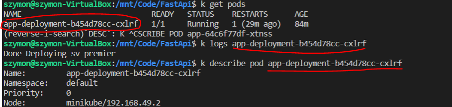

# Docker & k8s tutorial app
Build easy web application with using Docker, Docker-Compose, k8s and Minikube. Application was programmed in Python with FastApi and SQLalchemy.

# Docker-compose
***
## Prerequisites: ##
1. **Dockerfile** for app's environment
<<<<<<< HEAD
2. **Dockerimage** which is built with this command: <pre><code>docker build \app </code></pre>
=======
2. **Dockerimage** which is built with this command: <pre><code>docker build -t szymanel/app .</code></pre>
Use directory with your Dockerfile 
>>>>>>> 56b519984b4c29cb18802414f08012d9f5665065
3. Defined services in **docker-compose.yml** file

Command below will run entire app:
<pre><code>docker-compose down && docker-compose up</code></pre>

You can access web application with your browser using address below:
<pre><code>localhost:8000/docs</code></pre>
It's possible to use another ports to access this web application: <code>8080</code>, <code>8081</code> or <code>8085</code>
  

# k8s
***
Please, notice that for all commands below 'alias' was used as follows:
<pre><code>alias k="kubectl"</code></pre>

Steps to deploy:
1. <pre><code>minikube start --driver=docker</code></pre> or you can change driver to VirtualBox, Podman, Hyper-V. Please refer to: https://minikube.sigs.k8s.io/docs/drivers/ for more details
2. <pre><code>k apply -f deployment.yaml -f service.yaml</code></pre>
* Check whether pods and services were correctly deployed. Use these commands:

   * <pre><code>k get pods</code></pre>
   * <pre><code>k get svc</code></pre>
   * <pre><code>k get deploy</code></pre> 
In case there are some errors, please check 'logs' and 'description'. Use these commands:
 
   * <pre><code>k logs [NAME_POD]</code></pre>  
   * <pre><code>k describe pod [NAME_POD]</code></pre>
as below:  

3. Open new Terminal Window and use command:
   * <pre><code>minikube tunnel</code></pre>

4. Go back to previous Terminal Window and use command:
   * <pre><code>minikube service [NAME_SERVICE]</code></pre> (use command <code>k get svc</code> to find service name)   
   Web application should appear in new tab of your browser

 
Please, refer to documentation:    

### Docker & Docker Compose documentation  
https://docs.docker.com/compose/  

### Minikube documentation  
 https://minikube.sigs.k8s.io/docs/  

### k8s documentation  
https://kubernetes.io/docs/setup/  
   
Here are some most common bugs/issues with potential fixes:
### #k8s# CrashLoopBackOff Error:
* https://komodor.com/learn/how-to-fix-crashloopbackoff-kubernetes-error/?msclkid=774696e6c14511eca3c886b9d4e936ab
* https://stackoverflow.com/questions/60070108/crashloopbackoff-back-off-restarting-failed-container?msclkid=87368894c4c711ec997691160b357e23

### #Docker# Start, Stop, Remove Docker Containers 
* https://www.thegeekstuff.com/2016/04/docker-compose-up-stop-rm/#:~:text=1%20Start%20Docker%20Containers%20In%20the%20Background.%20All,running%20in%20the%20foreground%2C%20you%20just...%20More%20

### #Docker-Compose# Compose specification - fixing networks issues
* https://docs.docker.com/compose/compose-file/#network_mode

### #Docker# "Port is already allocated" error
* https://simplernerd.com/docker-port-allocated/

## Recommended tutorials and videos:
* https://www.youtube.com/watch?time_continue=1&v=d6WC5n9G_sM&feature=emb_logo
* https://www.youtube.com/watch?v=qmDzcu5uY1I
* https://www.youtube.com/watch?v=s_o8dwzRlu4

     
## Alternative option 
***
Please, note that there is one more option to deploy it from Docker-Compose by using **KOMPOSE** option. You need translate Docker Compose file to Kubernetes Resources. Use documentation below:
* https://kubernetes.io/docs/tasks/configure-pod-container/translate-compose-kubernetes/
